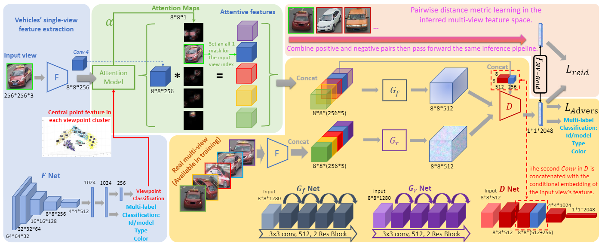

Papers: Data Generation For ReID
===

Included Conferences: CVPR, ICCV, ECCV, NeurIPS, etc.

<!-- Comment -->
<!-- -   [arXiv 2022](#arXiv-2022)  -->
<!--     -   [Next](#next)  -->

## View Synthesis

### CVPR 2022  

+ Multi-View Consistent Generative Adversarial Networks for 3D-Aware Image Synthesis    
[[paper](http://arxiv.org/abs/2204.06307)]  [[code]()]
  

    
Notes

  

 
+ Block-NeRF: Scalable Large Scene Neural View Synthesis       
[[paper](https://openaccess.thecvf.com/content/CVPR2022/papers/Tancik_Block-NeRF_Scalable_Large_Scene_Neural_View_Synthesis_CVPR_2022_paper.pdf)]  [[code]()]

+ Scene Representation Transformer: Geometry-Free Novel View Synthesis Through Set-Latent Scene Representations  
[[paper](http://arxiv.org/abs/2111.13152)]  [[code]()]
 
+ NeurMiPs: Neural Mixture of Planar Experts for View Synthesis      
[[paper](http://arxiv.org/abs/2204.13696)]  [[code]()]
 
+ Boosting View Synthesis With Residual Transfer  
[[paper](https://openaccess.thecvf.com/content/CVPR2022/papers/Rong_Boosting_View_Synthesis_With_Residual_Transfer_CVPR_2022_paper.pdf)]  [[code]()]

+ RegNeRF: Regularizing Neural Radiance Fields for View Synthesis From Sparse Inputs       
[[paper](http://arxiv.org/abs/2112.00724)]  [[code]()]

+ AutoRF: Learning 3D Object Radiance Fields From Single View Observations       
[[paper](https://openaccess.thecvf.com/content/CVPR2022/papers/Muller_AutoRF_Learning_3D_Object_Radiance_Fields_From_Single_View_Observations_CVPR_2022_paper.pdf)]  [[code]()]
  

    
Notes

  

 
+ [Spherical] SOMSI: Spherical Novel View Synthesis With Soft Occlusion Multi-Sphere Images       
[[paper](https://openaccess.thecvf.com/content/CVPR2022/papers/Habtegebrial_SOMSI_Spherical_Novel_View_Synthesis_With_Soft_Occlusion_Multi-Sphere_Images_CVPR_2022_paper.pdf)]  [[code]()]
 
+ JIFF: Jointly-Aligned Implicit Face Function for High Quality Single View Clothed Human Reconstruction   
[[paper](http://arxiv.org/abs/2204.10549)]  [[code]()]
 
+ NeRF in the Dark: High Dynamic Range View Synthesis From Noisy Raw Images       
[[paper](https://openaccess.thecvf.com/content/CVPR2022/papers/Mildenhall_NeRF_in_the_Dark_High_Dynamic_Range_View_Synthesis_From_CVPR_2022_paper.pdf)]  [[code]()]
 

### ICCV 2021   
 
+ Neural Radiance Flow for 4D View Synthesis and Video Processing     
[[paper](http://arxiv.org/abs/2012.09790)]  [[code]()]
 
+ Geometry-Free View Synthesis: Transformers and No 3D Priors        
[[paper](http://arxiv.org/abs/2104.07652)]  [[code]()]
 
+ Dynamic View Synthesis From Dynamic Monocular Video       
[[paper](http://arxiv.org/abs/2105.06468)]  [[code]()]
 
+ Putting NeRF on a Diet: Semantically Consistent Few-Shot View Synthesis       
[[paper](http://arxiv.org/abs/2104.00677)]  [[code]()]
 
+ [Render] Baking Neural Radiance Fields for Real-Time View Synthesis       
[[paper](http://arxiv.org/abs/2103.14645)]  [[code]()]
 
+ Non-Rigid Neural Radiance Fields: Reconstruction and Novel View Synthesis of a Dynamic Scene From Monocular Video     
[[paper](http://arxiv.org/abs/2012.12247)]  [[code]()]
 
+ MINE: Towards Continuous Depth MPI With NeRF for Novel View Synthesis      
[[paper](http://arxiv.org/abs/2103.14910)]  [[code]()]
 
+ Worldsheet: Wrapping the World in a 3D Sheet for View Synthesis From a Single Image       
[[paper](http://arxiv.org/abs/2012.09854)]  [[code]()]
 
+ [vedio] Deep 3D Mask Volume for View Synthesis of Dynamic Scenes     
[[paper](http://arxiv.org/abs/2108.13408)]  [[code]()]
 
### CVPR 2021  

+ Stereo Radiance Fields (SRF): Learning View Synthesis for Sparse Views of Novel Scenes   
[[paper](http://arxiv.org/abs/2104.06935)]  [[code]()]
 
+ Stable View Synthesis     
[[paper](http://arxiv.org/abs/2011.07233)]  [[code]()]
 
+ Layout-Guided Novel View Synthesis From a Single Indoor Panorama      
[[paper](http://arxiv.org/abs/2103.17022)]  [[code]()]
 
+ Learning Neural Representation of Camera Pose with Matrix Representation of Pose Shift via View Synthesis       
[[paper]()]  [[code]()]
  
+ ID-Unet: Iterative Soft and Hard Deformation for View Synthesis       
[[paper](https://openaccess.thecvf.com/content/CVPR2021/papers/Yin_ID-Unet_Iterative_Soft_and_Hard_Deformation_for_View_Synthesis_CVPR_2021_paper.pdf)]  [[code]()]
  
+ NeX: Real-Time View Synthesis With Neural Basis Expansion     
[[paper](http://arxiv.org/abs/2103.05606)]  [[code]()]
  
+ Neural Body: Implicit Neural Representations With Structured Latent Codes for Novel View Synthesis of Dynamic Humans       
[[paper](http://arxiv.org/abs/2012.15838)]  [[code]()]
  
+ Neural Scene Flow Fields for Space-Time View Synthesis of Dynamic Scenes     
[[paper](http://arxiv.org/abs/2011.13084)]  [[code]()]
  
+ NeRV: Neural Reflectance and Visibility Fields for Relighting and View Synthesis     
[[paper](http://arxiv.org/abs/2012.03927)]  [[code]()]
  
+ Self-Supervised Visibility Learning for Novel View Synthesis       
[[paper](http://arxiv.org/abs/2103.15407)]  [[code]()]
  
### CVPR 2020   
 
+ SynSin: End-to-End View Synthesis From a Single Image       
[[paper](http://arxiv.org/abs/1912.08804)]  [[code](http://arxiv.org/abs/1912.08804)]
  
+ Novel View Synthesis of Dynamic Scenes With Globally Coherent Depths From a Monocular Camera   
[[paper](http://arxiv.org/abs/2004.01294)]  [[code]()]
  
+ Single-View View Synthesis With Multiplane Images       
[[paper](http://arxiv.org/abs/2004.11364)]  [[code]()]

### ICCV 2019   
 
+ Liquid Warping GAN: A Unified Framework for Human Motion Imitation, Appearance Transfer and Novel View Synthesis     
[[paper](https://openaccess.thecvf.com/content_ICCV_2019/papers/Liu_Liquid_Warping_GAN_A_Unified_Framework_for_Human_Motion_Imitation_ICCV_2019_paper.pdf)]  [[code]()]
  
+ Extreme View Synthesis       
[[paper](https://openaccess.thecvf.com/content_ICCV_2019/papers/Choi_Extreme_View_Synthesis_ICCV_2019_paper.pdf)]  [[code]()]
  
+ View Independent Generative Adversarial Network for Novel View Synthesis     
[[paper](https://openaccess.thecvf.com/content_ICCV_2019/papers/Xu_View_Independent_Generative_Adversarial_Network_for_Novel_View_Synthesis_ICCV_2019_paper.pdf)]  [[code]()]

+ Pixel2Mesh++: Multi-View 3D Mesh Generation via Deformation       
[[paper](https://openaccess.thecvf.com/content_ICCV_2019/papers/Wen_Pixel2Mesh_Multi-View_3D_Mesh_Generation_via_Deformation_ICCV_2019_paper.pdf)]  [[code]()]

### CVPR 2019

+ DeepView: View Synthesis With Learned Gradient Descent       
[[paper](https://openaccess.thecvf.com/content_CVPR_2019/papers/Flynn_DeepView_View_Synthesis_With_Learned_Gradient_Descent_CVPR_2019_paper.pdf)]  [[code]()]

+ Structure-Preserving Stereoscopic View Synthesis With Multi-Scale Adversarial Correlation Matching       
[[paper](https://openaccess.thecvf.com/content_CVPR_2019/papers/Zhang_Structure-Preserving_Stereoscopic_View_Synthesis_With_Multi-Scale_Adversarial_Correlation_Matching_CVPR_2019_paper.pdf)]  [[code]()]

### arXiv 2022 

+ Paper     
[[paper]()]  [[code]()]

+ Paper     
[[paper]()]  [[code]()]

## MVC 

### CVPR 2022  

+ [3D] Multi-View Mesh Reconstruction With Neural Deferred Shading   
[[paper](https://openaccess.thecvf.com/content/CVPR2022/papers/Worchel_Multi-View_Mesh_Reconstruction_With_Neural_Deferred_Shading_CVPR_2022_paper.pdf)]  [[code]()]
 
+ [3D] Topologically-Aware Deformation Fields for Single-View 3D Reconstruction  
[[paper](http://arxiv.org/abs/2205.06267)]  [[code]()]
 
+ [3D] FWD: Real-Time Novel View Synthesis With Forward Warping and Depth     
[[paper](https://openaccess.thecvf.com/content/CVPR2022/papers/Cao_FWD_Real-Time_Novel_View_Synthesis_With_Forward_Warping_and_Depth_CVPR_2022_paper.pdf)]  [[code]()]
 
+ [3D] FvOR: Robust Joint Shape and Pose Optimization for Few-View Object Reconstruction        
[[paper](http://arxiv.org/abs/2205.07763)]  [[code]()]
 
+ Efficient Multi-View Stereo by Iterative Dynamic Cost Volume       
[[paper](https://openaccess.thecvf.com/content/CVPR2022/papers/Wang_Efficient_Multi-View_Stereo_by_Iterative_Dynamic_Cost_Volume_CVPR_2022_paper.pdf)]  [[code]()]
 
+ MVS2D: Efficient Multi-View Stereo via Attention-Driven 2D Convolutions   
[[paper](http://arxiv.org/abs/2104.13325)]  [[code]()]
 
### ICCV 2021  

+ AA-RMVSNet: Adaptive Aggregation Recurrent Multi-View Stereo Network       
[[paper](https://openaccess.thecvf.com/content/ICCV2021/papers/Wei_AA-RMVSNet_Adaptive_Aggregation_Recurrent_Multi-View_Stereo_Network_ICCV_2021_paper.pdf)]  [[code]()]
 
+ [MVS] A Confidence-Based Iterative Solver of Depths and Surface Normals for Deep Multi-View Stereo   
[[paper](https://openaccess.thecvf.com/content/ICCV2021/papers/Zhao_A_Confidence-Based_Iterative_Solver_of_Depths_and_Surface_Normals_for_ICCV_2021_paper.pdf)]  [[code]()]
 
+ Multi-View 3D Reconstruction With Transformers      
[[paper](http://arxiv.org/abs/2103.12957)]  [[code]()]

+ NerfingMVS: Guided Optimization of Neural Radiance Fields for Indoor Multi-View Stereo       
[[paper](http://arxiv.org/abs/2109.01129)]  [[code]()]
 
+ MVSNeRF: Fast Generalizable Radiance Field Reconstruction From Multi-View Stereo     
[[paper](http://arxiv.org/abs/2103.15595)]  [[code]()]
 
+ Toward Realistic Single-View 3D Object Reconstruction With Unsupervised Learning From Multiple Images     
[[paper](http://arxiv.org/abs/2109.02288)]  [[code]()]
 
+ UNISURF: Unifying Neural Implicit Surfaces and Radiance Fields for Multi-View Reconstruction   
[[paper](http://arxiv.org/abs/2104.10078)]  [[code]()]
 
+ [Face MVS] Topologically Consistent Multi-View Face Inference Using Volumetric Sampling     
[[paper](http://arxiv.org/abs/2110.02948)]  [[code]()]
 

### arXiv 2022 

+ Paper     
[[paper]()]  [[code]()]
  

    
Notes

      
    - Key points:
         - Important.
         - SOTA.
  

