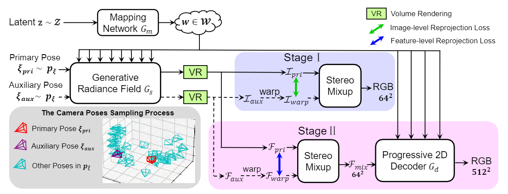
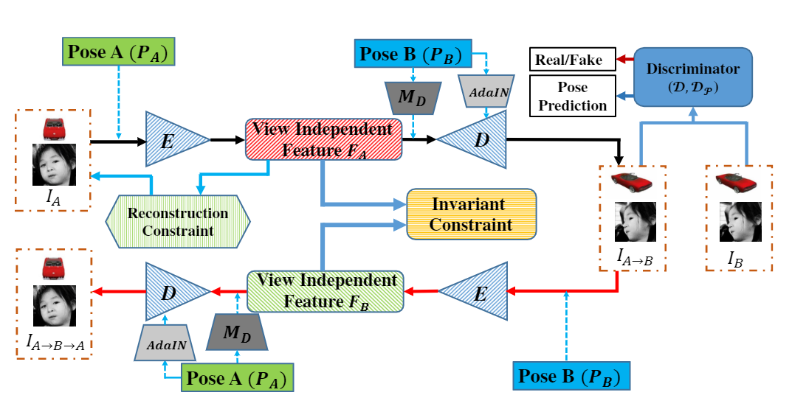

Papers: Image Synthesis for Re-identification 
===

Included Conferences: CVPR, ICCV, ECCV, NeurIPS, WACV, etc.

 -   [View Synthesis](#View-Synthesis)  
 -   [Style Synthesis](#Style-Synthesis)  
 -   [Multi-View Stereo (MVS)](#MVS)    
<!--     -   [CVPR 2022](#CVPR-2022) -->

## View Synthesis

#### CVPR 2022  

+ Multi-View Consistent Generative Adversarial Networks for 3D-Aware Image Synthesis    
[[paper](http://arxiv.org/abs/2204.06307)]  [[code](https://github.com/Xuanmeng-Zhang/MVCGAN)]
  

    
Notes

        
 
    - Key points:
         - Two parts of Loss: (1) GAN loss; (2) Geometry constraint loss: minimize the distance between I_pri and I_warp (Stage I), F_pri and F_warp (Stage II); 
         - Camera pose pξ: uniform/gaussian distribution;
         - Gd: progressive style-based 2D decoder, upsamples F_mix; 
         - Dφ: progressive growing convolutional discriminator.
    
 

+ (Scene) FWD: Real-Time Novel View Synthesis With Forward Warping and Depth     
[[paper](https://openaccess.thecvf.com/content/CVPR2022/papers/Cao_FWD_Real-Time_Novel_View_Synthesis_With_Forward_Warping_and_Depth_CVPR_2022_paper.pdf)]  
 
+ (Block, Buildings) Block-NeRF: Scalable Large Scene Neural View Synthesis       
[[paper](https://openaccess.thecvf.com/content/CVPR2022/papers/Tancik_Block-NeRF_Scalable_Large_Scene_Neural_View_Synthesis_CVPR_2022_paper.pdf)] 

+ (Scene) Scene Representation Transformer: Geometry-Free Novel View Synthesis Through Set-Latent Scene Representations  
[[paper](http://arxiv.org/abs/2111.13152)] 
 
+ (Scene) NeurMiPs: Neural Mixture of Planar Experts for View Synthesis      
[[paper](http://arxiv.org/abs/2204.13696)] 
 
+ (Scene) Boosting View Synthesis With Residual Transfer  
[[paper](https://openaccess.thecvf.com/content/CVPR2022/papers/Rong_Boosting_View_Synthesis_With_Residual_Transfer_CVPR_2022_paper.pdf)]  

+ (Sprase input) RegNeRF: Regularizing Neural Radiance Fields for View Synthesis From Sparse Inputs       
[[paper](http://arxiv.org/abs/2112.00724)]  

+ AutoRF: Learning 3D Object Radiance Fields From Single View Observations       
[[paper](https://openaccess.thecvf.com/content/CVPR2022/papers/Muller_AutoRF_Learning_3D_Object_Radiance_Fields_From_Single_View_Observations_CVPR_2022_paper.pdf)]   
 
+ (Spherical input) SOMSI: Spherical Novel View Synthesis With Soft Occlusion Multi-Sphere Images       
[[paper](https://openaccess.thecvf.com/content/CVPR2022/papers/Habtegebrial_SOMSI_Spherical_Novel_View_Synthesis_With_Soft_Occlusion_Multi-Sphere_Images_CVPR_2022_paper.pdf)]  
 
+ (Human, Face render) JIFF: Jointly-Aligned Implicit Face Function for High Quality Single View Clothed Human Reconstruction   
[[paper](http://arxiv.org/abs/2204.10549)]  
 
+ (HDR NERF) NeRF in the Dark: High Dynamic Range View Synthesis From Noisy Raw Images       
[[paper](https://openaccess.thecvf.com/content/CVPR2022/papers/Mildenhall_NeRF_in_the_Dark_High_Dynamic_Range_View_Synthesis_From_CVPR_2022_paper.pdf)]  
 
+ Pix2NeRF: Unsupervised Conditional π-GAN for Single Image to Neural Radiance Fields Translation     
[[paper](https://openaccess.thecvf.com/content/CVPR2022/papers/Cai_Pix2NeRF_Unsupervised_Conditional_p-GAN_for_Single_Image_to_Neural_Radiance_CVPR_2022_paper.pdf)]  [[code](https://github.com/primecai/Pix2NeRF)]

#### ICCV 2021   

+ (Human) Attack-Guided Perceptual Data Generation for Real-World Re-Identification  
[[paper](https://openaccess.thecvf.com/content/ICCV2021/papers/Huang_Attack-Guided_Perceptual_Data_Generation_for_Real-World_Re-Identification_ICCV_2021_paper.pdf)][[No code]] 
   

     
Notes

         

     - Key points:
          - Use 2 encoders to get disentangled features fc(content-related feature) and fd(degradation features); 
          - Use a GCN-based atacker(A_d) to guide the data generation process with intra-batch ranking and discriminate attention. (Takes degradation feature and batch-wised affinity matrix(calculated by identity embeddings) as input);
          - Perceptual Augmentation loss: (a)Self-spervised for degraded version of high-resolution image; (b)Reconstrution for three versions. (c)perceptual quality score: hr close to 1, lr close to -1;
          - ReID-driven Perceptual Attack: (a)For E_id, maximize intra-class distance，minimize inter-class distance to misalign the identity features.(b)attention attack loss? (c) GAN loss for G,D; 
          - For inference: (a)minmize max(distance between real I and one of generated samples I_gen); (b)Wasserstein distance between Eid(I) and Eid(I_gen); (c)cross-entropy loss.
    
 
 
+ (Vedio) Neural Radiance Flow for 4D View Synthesis and Video Processing     
[[paper](http://arxiv.org/abs/2012.09790)]  
 
+ (Scene) Geometry-Free View Synthesis: Transformers and No 3D Priors        
[[paper](http://arxiv.org/abs/2104.07652)]  
 
+ (Monocular: Vedio moving views) Dynamic View Synthesis From Dynamic Monocular Video       
[[paper](http://arxiv.org/abs/2105.06468)]  
 
+ Putting NeRF on a Diet: Semantically Consistent Few-Shot View Synthesis       
[[paper](http://arxiv.org/abs/2104.00677)]  
 
+ Baking Neural Radiance Fields for Real-Time View Synthesis       
[[paper](http://arxiv.org/abs/2103.14645)]  
 
+ (Vedio) Non-Rigid Neural Radiance Fields: Reconstruction and Novel View Synthesis of a Dynamic Scene From Monocular Video     
[[paper](http://arxiv.org/abs/2012.12247)]  
 
+ (Scene, MPI) MINE: Towards Continuous Depth MPI With NeRF for Novel View Synthesis      
[[paper](http://arxiv.org/abs/2103.14910)]  
 
+ Worldsheet: Wrapping the World in a 3D Sheet for View Synthesis From a Single Image       
[[paper](http://arxiv.org/abs/2012.09854)]  
 
+ (Vedio) Deep 3D Mask Volume for View Synthesis of Dynamic Scenes     
[[paper](http://arxiv.org/abs/2108.13408)]  
 
#### CVPR 2021  

+ [BEST PAPER] GIRAFFE: Representing Scenes as Compositional Generative Neural Feature Fields  
[[paper](https://arxiv.org/abs/2011.12100)][[code](https://github.com/autonomousvision/giraffe)]
  

    
Notes

      
  

+ pi-GAN: Periodic Implicit Generative Adversarial Networks for 3D-Aware Image Synthesis   
[[paper](https://arxiv.org/abs/2012.00926)][[code](https://github.com/marcoamonteiro/pi-GAN)]
  

    
Notes

        
 
    - Key points:
         - Mapping network takes noise vector z as input and outputs frequencies γi and phase shifts βi, which condition each layer of the SIREN; 
         - Progressive dicriminator;
         - Generator: Increase the resolution by sampling rays more densely from the same implicit representation; 
         - GAN loss (camera pose ξ determines x and d).

    
 

+ Joint Generative and Contrastive Learning for Unsupervised Person Re-Identification  
[[paper](http://arxiv.org/abs/2012.09071)][[code](https://github.com/chenhao2345/GCL)]  
  

     
Notes

         

     - Key points:
          - Combine generative module with contrastive module into joint training framework, where GAN provides data augmentation and contrastive module learns identity feature for generation; 
          - Generator includes identity encoder Eid (forms identity feature F_id), structure encoder Estr (forms F_str), decoder G(generates images) and discriminator D; 
          - Structure features are encoded from structure projection through HMR; 
          - Loss:
            - 1. Reconstruction: (x, x'_ori, x''_ori). 
            - 2. Feature reconstruction: similar F_id of (x, x_new, x''_ori)
            - 3. GAN loss: (x'_ori, x'_new, x''_ori) 
            - 4. SSL loss: 3 positive paris(f, f'_new, f_pos) and K negative pairs, where f=Eid(x), f’_new=Eid(x’_new), f_pos is chosen from memory bank which has same pseudo identity with f.
    
 

+ Stereo Radiance Fields (SRF): Learning View Synthesis for Sparse Views of Novel Scenes   
[[paper](http://arxiv.org/abs/2104.06935)]  
 
+ Stable View Synthesis     
[[paper](http://arxiv.org/abs/2011.07233)]  
 
+ (Scene, Panorama input) Layout-Guided Novel View Synthesis From a Single Indoor Panorama      
[[paper](http://arxiv.org/abs/2103.17022)]  
 
+ Learning Neural Representation of Camera Pose with Matrix Representation of Pose Shift via View Synthesis       
[[paper](http://arxiv.org/abs/2104.01508)]  
  
+ ID-Unet: Iterative Soft and Hard Deformation for View Synthesis       
[[paper](https://openaccess.thecvf.com/content/CVPR2021/papers/Yin_ID-Unet_Iterative_Soft_and_Hard_Deformation_for_View_Synthesis_CVPR_2021_paper.pdf)]  [[code](https://github.com/MingyuY/Iterative-view-synthesis)]
  

    
Notes

      
  

  
+ (Scene) NeX: Real-Time View Synthesis With Neural Basis Expansion     
[[paper](http://arxiv.org/abs/2103.05606)]  
  
+ (Human body) Neural Body: Implicit Neural Representations With Structured Latent Codes for Novel View Synthesis of Dynamic Humans       
[[paper](http://arxiv.org/abs/2012.15838)]  
  
+ (Vedio) Neural Scene Flow Fields for Space-Time View Synthesis of Dynamic Scenes     
[[paper](http://arxiv.org/abs/2011.13084)]  
  
+ (Novel lighting) NeRV: Neural Reflectance and Visibility Fields for Relighting and View Synthesis     
[[paper](http://arxiv.org/abs/2012.03927)]  
  
+ (Scene) Self-Supervised Visibility Learning for Novel View Synthesis       
[[paper](http://arxiv.org/abs/2103.15407)]  

#### ECCV2020

+ [BEST PAPER——NERF] Representing Scenes as Neural Radiance Fields for View Synthesis  
[[paper](https://arxiv.org/abs/2003.08934)][[code](https://github.com/yenchenlin/nerf-pytorch)]
   

       
Note

          
    
 

+ Novel View Synthesis on Unpaired Data by Conditional Deformable Variational Auto-Encoder  
[[paper](https://arxiv.org/abs/2007.10618)]

#### CVPR 2020   
 
+ (Scene) SynSin: End-to-End View Synthesis From a Single Image       
[[paper](http://arxiv.org/abs/1912.08804)]  
  
+ (Monocular) Novel View Synthesis of Dynamic Scenes With Globally Coherent Depths From a Monocular Camera   
[[paper](http://arxiv.org/abs/2004.01294)]  
  
+ (Scene, MPI) Single-View View Synthesis With Multiplane Images       
[[paper](http://arxiv.org/abs/2004.11364)]  

#### NeurIPS 2020
+ GRAF: Generative Radiance Fields for 3D-Aware Image Synthesis         
[[paper](https://arxiv.org/abs/2007.02442)][[code](https://github.com/autonomousvision/graf)]  
   

    
Note

        
        
    - Key points:
         
    
 

#### ICCV 2019   
 
+ (Human: Pose, View, Appearance) Liquid Warping GAN: A Unified Framework for Human Motion Imitation, Appearance Transfer and Novel View Synthesis     
[[paper](https://openaccess.thecvf.com/content_ICCV_2019/papers/Liu_Liquid_Warping_GAN_A_Unified_Framework_for_Human_Motion_Imitation_ICCV_2019_paper.pdf)][[code](https://github.com/svip-lab/impersonator)]
   

       
Note

          
    
 
  
+ (Scene) Extreme View Synthesis       
[[paper](https://openaccess.thecvf.com/content_ICCV_2019/papers/Choi_Extreme_View_Synthesis_ICCV_2019_paper.pdf)]  
  
+ View Independent Generative Adversarial Network for Novel View Synthesis     
[[paper](https://openaccess.thecvf.com/content_ICCV_2019/papers/Xu_View_Independent_Generative_Adversarial_Network_for_Novel_View_Synthesis_ICCV_2019_paper.pdf)][[No code]]
  

    
Note

        
 
    - Key points:
         - Four parts of LOSS: 
           - 1. View-independent(equal id of input view and generating view after encoding); 
           - 2. Recontruction(Minimize the distance between generating view and ground truth(directly and using VGG16), input view and reconstructing input view by DECODER, input view and re-generating input view through generating view.); 
           - 3. GAN loss(improve realism); 
           - 4. Pose prediction loss(second discriminator predicts target views(P_B) when inputting GT and generating images)..
         - Use an ENCODER for the disentangling task(extracting view-independent intrinsic features) and a DECODER for the rendering task(generating target view).
    
 

+ Pixel2Mesh++: Multi-View 3D Mesh Generation via Deformation       
[[paper](https://openaccess.thecvf.com/content_ICCV_2019/papers/Wen_Pixel2Mesh_Multi-View_3D_Mesh_Generation_via_Deformation_ICCV_2019_paper.pdf)]  

#### CVPR 2019

+ (Scene) DeepView: View Synthesis With Learned Gradient Descent       
[[paper](https://openaccess.thecvf.com/content_CVPR_2019/papers/Flynn_DeepView_View_Synthesis_With_Learned_Gradient_Descent_CVPR_2019_paper.pdf)]  

+ (Scene) Structure-Preserving Stereoscopic View Synthesis With Multi-Scale Adversarial Correlation Matching       
[[paper](https://openaccess.thecvf.com/content_CVPR_2019/papers/Zhang_Structure-Preserving_Stereoscopic_View_Synthesis_With_Multi-Scale_Adversarial_Correlation_Matching_CVPR_2019_paper.pdf)]  

#### NeurIPS 2019
+ Positional Normalization  
[[paper](https://arxiv.org/abs/1907.04312)]  

#### ECCV 2018
+ Multi-view to Novel view: Synthesizing novel views with Self-Learned Confidence  
[[paper](https://openaccess.thecvf.com/content_ECCV_2018/papers/Shao-Hua_Sun_Multi-view_to_Novel_ECCV_2018_paper.pdf)]

#### CVPR 2018
+ (Vehicle) Viewpoint-aware Attentive Multi-view Inference for Vehicle Re-identification       
[[paper](https://openaccess.thecvf.com/content_cvpr_2018/papers/Zhou_Viewpoint-Aware_Attentive_Multi-View_CVPR_2018_paper.pdf)][[No code]]
  

    
Notes

      
  

#### BMVC
+ (Vehicle) Cross-View GAN Based Vehicle Generation for Re-identification                
[[paper](http://www.bmva.org/bmvc/2017/papers/paper186/paper186.pdf)][[No code]]
  

    
Notes

      
  

## Style Synthesis

#### CVPR 2022 

+ StylizedNeRF: Consistent 3D Scene Stylization As Stylized NeRF via 2D-3D Mutual Learning       
[[paper](http://arxiv.org/abs/2205.12183)]  

+ 3D Photo Stylization: Learning To Generate Stylized Novel Views From a Single Image       
[[paper](http://arxiv.org/abs/2112.00169)]  

#### CVPR 2020 
+ Stylization-Based Architecture for Fast Deep Exemplar Colorization       
[[paper](https://openaccess.thecvf.com/content_CVPR_2020/papers/Xu_Stylization-Based_Architecture_for_Fast_Deep_Exemplar_Colorization_CVPR_2020_paper.pdf)]  

#### WACV 2020
+ (Human) Semantic Consistency and Identity Mapping Multi-Component Generative Adversarial Network for Person Re-Identification  
[[paper](https://openaccess.thecvf.com/content_WACV_2020/papers/Khatun_Semantic_Consistency_and_Identity_Mapping_Multi-Component_Generative_Adversarial_Network_for_WACV_2020_paper.pdf)]  

#### CVPR 2019 
+ (Human) Joint Discriminative and Generative Learning for Person Re-Identification  
[[paper](https://openaccess.thecvf.com/content_CVPR_2019/papers/Zheng_Joint_Discriminative_and_Generative_Learning_for_Person_Re-Identification_CVPR_2019_paper.pdf)][[code](https://github.com/NVlabs/DG-Net)]  
   

       
Note

          
 
       - Key points:
            - Generative module encodes each person into an appearance code A and a structure code S; 
            - Discriminative module shares the appearance encoder with the generative module;
            - By switching the appearance or structure codes, the generative module generates high-quality cross-id composed images, which are online fed back to the appearance encoder and used to improve the discriminative module; 
            - Loss: (a)Reconstruction loss: L1(x_i, G(Ai, Si)), L1(x_i, G(At, Si));  (b)Encoder loss: L1(Ai, E1(G(Ai, Sj))), L1(Sj, E2(G(Ai, Sj)))  (c)GAN loss: L_adv = E[log D(xi) + log(1 − D(G(ai, sj))]  (d)Id loss (CE loss): E[−log(p(yi|xi))], E[−log(p(yi|xj))].
    
 

## MVS

#### CVPR 2022  

+ Multi-View Mesh Reconstruction With Neural Deferred Shading   
[[paper](https://openaccess.thecvf.com/content/CVPR2022/papers/Worchel_Multi-View_Mesh_Reconstruction_With_Neural_Deferred_Shading_CVPR_2022_paper.pdf)]  
 
+ Topologically-Aware Deformation Fields for Single-View 3D Reconstruction  
[[paper](http://arxiv.org/abs/2205.06267)]  
 
+ FvOR: Robust Joint Shape and Pose Optimization for Few-View Object Reconstruction        
[[paper](http://arxiv.org/abs/2205.07763)]  
 
+ Efficient Multi-View Stereo by Iterative Dynamic Cost Volume       
[[paper](https://openaccess.thecvf.com/content/CVPR2022/papers/Wang_Efficient_Multi-View_Stereo_by_Iterative_Dynamic_Cost_Volume_CVPR_2022_paper.pdf)]  
 
+ MVS2D: Efficient Multi-View Stereo via Attention-Driven 2D Convolutions   
[[paper](http://arxiv.org/abs/2104.13325)]  
 
#### ICCV 2021  

+ AA-RMVSNet: Adaptive Aggregation Recurrent Multi-View Stereo Network       
[[paper](https://openaccess.thecvf.com/content/ICCV2021/papers/Wei_AA-RMVSNet_Adaptive_Aggregation_Recurrent_Multi-View_Stereo_Network_ICCV_2021_paper.pdf)]  
 
+ A Confidence-Based Iterative Solver of Depths and Surface Normals for Deep Multi-View Stereo   
[[paper](https://openaccess.thecvf.com/content/ICCV2021/papers/Zhao_A_Confidence-Based_Iterative_Solver_of_Depths_and_Surface_Normals_for_ICCV_2021_paper.pdf)]   
 
+ Multi-View 3D Reconstruction With Transformers      
[[paper](http://arxiv.org/abs/2103.12957)]  

+ NerfingMVS: Guided Optimization of Neural Radiance Fields for Indoor Multi-View Stereo       
[[paper](http://arxiv.org/abs/2109.01129)]  
 
+ MVSNeRF: Fast Generalizable Radiance Field Reconstruction From Multi-View Stereo     
[[paper](http://arxiv.org/abs/2103.15595)]  
 
+ Toward Realistic Single-View 3D Object Reconstruction With Unsupervised Learning From Multiple Images     
[[paper](http://arxiv.org/abs/2109.02288)]  
 
+ UNISURF: Unifying Neural Implicit Surfaces and Radiance Fields for Multi-View Reconstruction   
[[paper](http://arxiv.org/abs/2104.10078)]  
 
+ Topologically Consistent Multi-View Face Inference Using Volumetric Sampling     
[[paper](http://arxiv.org/abs/2110.02948)]  

#### CVPR 2019 
+ (Human) Re-Identification Supervised Texture Generation  
[[paper](https://openaccess.thecvf.com/content_CVPR_2019/papers/Wang_Re-Identification_Supervised_Texture_Generation_CVPR_2019_paper.pdf)]  

